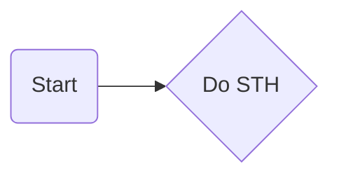

# Zhihu Spider
A web spider catching zhihu answer and saving as PDF or Markdown file.

## Aim

This is a python practicing project which I will implement a simple web spider in python. (for my homework.) Sometime I browse zhihu and find something valuable. I want to save it as a pdf of markdown file so that I can read it offline in my Kindle. That is what this project does.

## Design (Diagram)

### Programming Language 

**Web scraping** is the process of gathering information from the Internet. Many advanced and highly evolved web scraping libraries make python such a popular and the best (probably) programming language for web scraping.

## Introduction 

